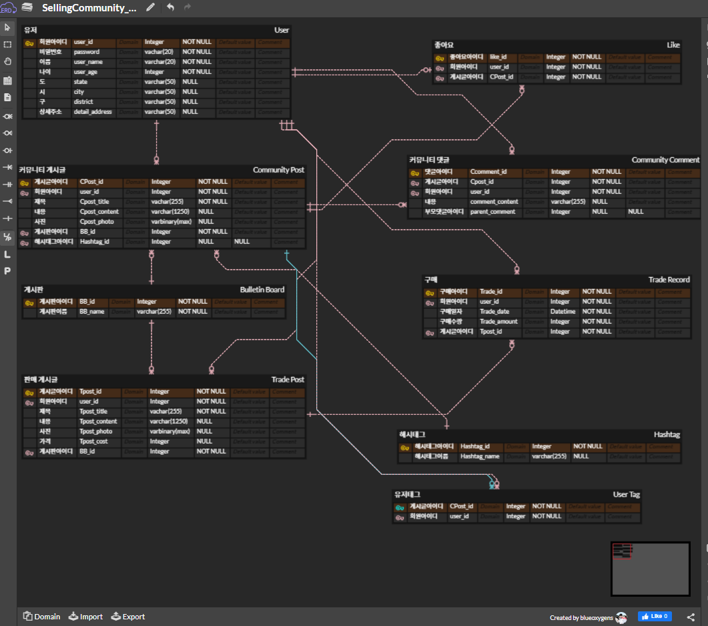

1. 유저는 회원아이디,비밀번호,이름,나이,주소를 통해 가입가능하고 id로 식별(기본키)한다.
2. 커뮤니티게시판은 게시글작성유저, 제목, 내용, 사진 정보가있고 id로 식별(기본키)한다.
3. 댓글은 댓글작성유저, 내용 정보가 있고 id로 식별(기본키)한다.
4. 판매게시판은 판매글작성유저, 제목, 내용, 가격, 사진 정보가 있고 id로 식별(기본키)한다.
5. 유저는 커뮤니티게시글에 좋아요를 누를수 있다. 좋아요는 id로 식별(기본키)한다.
6. 유저는 판매게시판의 올라온 물품을 구매 할 수 있다.
7. 유저가 물품을 구매하면 구매에 대한 구매일자,구매수량을 유지해야한다. 구매는 id로 식별(기본키)한다.

1 2 3 4 5 6 7 전부 설계 완료했습니다.
추가 챌린지는 3번까지 완료했습니다.

https://www.erdcloud.com/d/kmXKhEDn5ZFQt53zx

